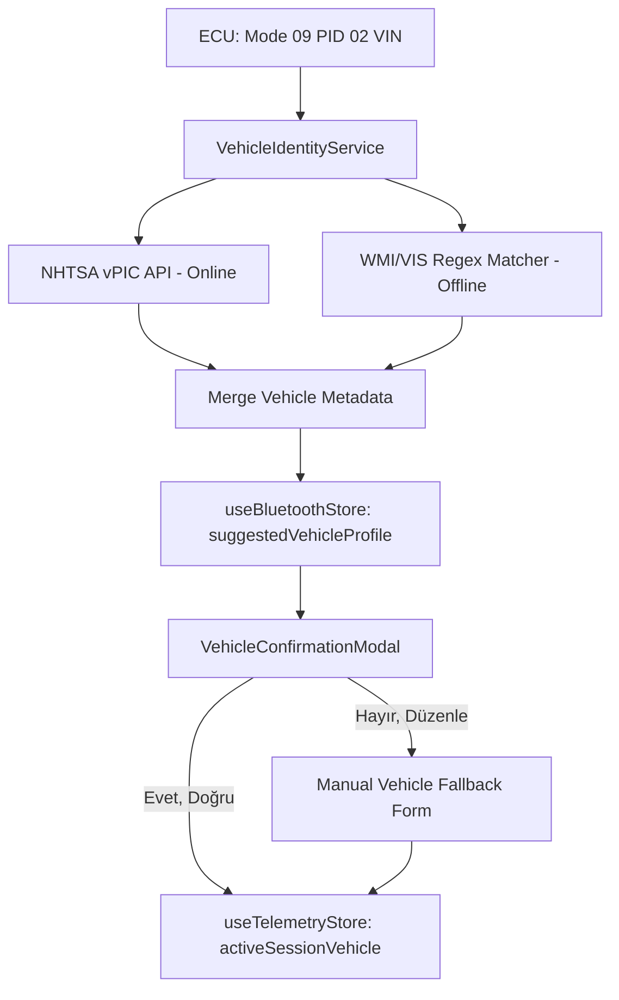

# Implementation Plan: MotoCortex Vehicle Identity Engine (VIE)

> **Not:** Bu bir feature planıdır, kalıcı bir ajan kuralı değildir. Bu
> yüzden `.agents/rules/` altında değil, `.agents/plans/` altındadır.
> Feature tamamlandığında arşivlenebilir. Bu plana uyarken geçerli olan
> kalıcı kurallar: `global-constraints.md`, `language-sync.md`,
> `design.md`, `state-architecture.md`,
> `anti-hallucination.md`.

Bu plan, **MotoCortex** uygulamasında araç bağlantısı kurulur kurulmaz
kullanıcıyı yormadan, ECU'dan okunan şasi numarası (VIN) üzerinden aracın
markasını, modelini, yılını, motorunu, yakıt türünü ve şanzıman tipini
otomatik algılayan, kullanıcıdan doğrulama (confirm) talep eden ve
doğrulamaya göre dinamik diagnostik stratejisi belirleyen **Vehicle
Identity Engine (VIE)** mimarisinin kurulmasını hedefler.

---

## User Review Required

> [!IMPORTANT]
> **Çevrimiçi/Çevrimdışı Hibrit VIN Decode Stratejisi:**
> VIN decode işlemleri için internet bağlantısı olduğunda ücretsiz Amerikan
> hükümeti **NHTSA vPIC API** servisi sorgulanacak; internet bağlantısı
> bulunmadığında ise uygulama içinde saklanan statik **WMI/VIS
> (Üretici/Model Yılı) Regex Mapping** motoru devreye girerek çevrimdışı
> durumlarda bile temel araç kimliğini (Marka, Model Yılı ve Tahmini Motor)
> tespit edebilecektir.

> [!WARNING]
> **Doğrulama ve Fallback Formu (UX Standartları):**
> Şasi numarasından veya harici API'lerden alınan veriler %100 doğru
> olmayabilir. Bu nedenle kullanıcıya gösterilecek ekran bir dayatma değil,
> **düzenlenebilir doğrulama kartı** şeklinde tasarlanacaktır. Kullanıcı
> yanlış bir eşleşme tespit ettiğinde, tek dokunuşla tüm alanları (Marka,
> Model, Yıl, Şanzıman, Yakıt) el ile seçebileceği responsive bir fallback
> formuna yönlendirilecektir.

> [!NOTE]
> **Confidence eşiği tanımsız (önceki plandan kalan boşluk):**
> `SuggestedVehicleProfile.confidence` alanı hangi eşiğin altında otomatik
> olarak fallback formuna yönlendireceğini belirtmiyor. Bu plan onaylanmadan
> önce eşik (örn. `confidence < 0.6` → direkt fallback formu, aradaysa
> doğrulama kartı) netleştirilmelidir.

---

## Proposed Changes



---

### 1. VIN Decoding & Metadata Layer

#### [MODIFY] `src/utils/vinDecoder.ts`
- **WMI Standartlarının Genişletilmesi:** Mevcut `HONDA` ve `TOYOTA` WMI
  listesine; `DACIA`, `RENAULT`, `HYUNDAI`, `VOLKSWAGEN`, `BMW`,
  `MERCEDES` ve `FORD` markalarını ekleyen regex'lerin yazılması.
- **Model Yılı Çözümleme (VIS 10th Character):** VIN'in 10. karakterinden
  model yılını (2000-2029 arası) deterministik olarak çözen
  `getYearFromVin(vin: string): number` fonksiyonunun eklenmesi.

#### [NEW] `src/services/VehicleIdentityService.ts`
- Hibrit araç tanıma servisi.
- `decodeVehicleFromVin(vin: string): Promise<VehicleProfile>`:
  - Öncelikle `fetch` ile
    `https://vpic.nhtsa.dot.gov/api/vehicles/decodevinvalues/${vin}?format=json`
    adresine istek göndererek zengin araç özniteliklerini çeker.
  - Ağ hatası veya timeout durumlarında yerel `getMakeFromVin` ve
    `getYearFromVin` metotlarını kullanarak çevrimdışı fallback profili
    üretir.
  - Elde edilen profildeki değerlerin güvenilirlik puanını (`confidence`)
    belirler.

---

### 2. Global State Layer

#### [MODIFY] `src/store/useBluetoothStore.ts`
- `suggestedVehicleProfile` adında yeni bir state tanımlanması:
  ```typescript
  interface SuggestedVehicleProfile {
      make: string;
      model: string;
      year: number;
      fuelType: string | null;
      transmission: string | null;
      confidence: number;
  }
  ```
- Bu state'i güncelleyen ve sıfırlayan action'ların eklenmesi.
- **Mimari uyum notu (`state-architecture.md` madde 1):**
  Bu state `useBluetoothStore` içine eklenir, yeni bir store veya hook
  oluşturulmaz — single source of truth kuralı burada da geçerlidir.

---

### 3. User Interface Layer (UI/UX)

#### [NEW] `src/screens/sandbox/VehicleConfirmationModal.tsx`
- Kullanıcıya araç verileri çözümlendiğinde gösterilecek responsive
  doğrulama modülü.
- `react-native-size-matters` kullanılarak tasarlanmış, flex konfigürasyonlu
  ve keyboard avoiding view destekli olmalıdır (bkz. `design.md`).
- **Alanlar:** Marka, Model, Yıl, Şanzıman Tipi ve Yakıt Türü bilgileri —
  tüm label ve buton metinleri `t('key', 'English Default')` üzerinden
  bağlanır (bkz. `language-sync.md`), hardcode metin yasaktır.
- **Butonlar:**
  - `[CONFIRM]` (Evet, Doğru): Seçilen profili onaylar ve aktif oturum
    aracı olarak kaydeder.
  - `[EDIT]` (Hayır, Düzenle): Kademeli manuel seçim formuna (fallback
    form) geçişi sağlar.

---

### 4. Integration & Routing Layer

#### [MODIFY] `src/hooks/useBluetooth.ts`
- `handleVinReceived` metodu güncellenerek, şasi numarası başarıyla
  alındığında `VehicleIdentityService` tetiklenecek ve elde edilen profil
  `useBluetoothStore` store'una yazılarak doğrulama modal'ı tetiklenecektir.

---

## Verification Plan

### Automated Tests
- `src/utils/__tests__/vinDecoder.test.ts`:
  - Dacia Logan VIN'i (`UU1...`) için `DACIA` markasının ve 10. karaktere
    göre model yılının doğru tespit edildiği,
  - Hyundai H100 VIN'i (`KMH...`) için `HYUNDAI` markasının doğru tespit
    edildiği test edilecektir.
- `src/services/__tests__/VehicleIdentityService.test.ts`:
  - NHTSA API yanıtının çevrimiçi durumda doğru profil ürettiği
    doğrulanacaktır (mock fetch, success path).
  - **Fallback/timeout branch (`anti-hallucination.md` madde 3
    gereği zorunlu):** `jest.useFakeTimers()` ile network timeout senaryosu
    deterministik olarak simüle edilir; `jest.advanceTimersByTime()` ile
    timeout süresi geçildiğinde servisin offline `getMakeFromVin`/
    `getYearFromVin` fallback'ine düştüğü ve doğru `confidence` skorunu
    ürettiği doğrulanır. Sadece başarı senaryosunu mock'lamak yeterli
    değildir — bu madde eklenmeden bu plan verification açısından eksik
    sayılır.
- Jest test komutları:
  ```bash
  npm test src/utils/__tests__/vinDecoder.test.ts
  npm test src/services/__tests__/VehicleIdentityService.test.ts
  ```

### Manual Verification
1. **Sandbox Ekranı Entegrasyon Testi:** Sandbox ekranında el sıkışma
   tamamlanıp VIN okunduğu an, ekranda "Aracınızı Tanıdık" doğrulama
   modal'ının responsive tasarımla açıldığı gözlemlenecek.
2. **Düzenleme ve Fallback Akışı:** "Hayır, Düzenle" butonuna tıklandığında
   modal'ın manuel seçim formuna dönüştüğü ve kullanıcının verileri el ile
   değiştirerek başarılı şekilde kaydedebildiği test edilecek.
3. **Çevrimdışı Mod Testi:** Cihaz uçak moduna alınıp internet kesildiğinde,
   VIN okuma sonrası NHTSA API yerine lokal offline decoder'ın devreye
   girerek temel araç kimliğini başarıyla çıkarttığı doğrulanacak.

### Pre-merge checklist
Bu plan implementasyonu tamamlandığında, merge öncesi:
- [ ] `anti-hallucination.md` — kanıt/test doğrulaması
- [ ] `architecture-review.md` — mimari/i18n/UI uyumu
