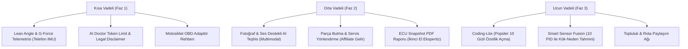

# MotoCortex — Global Pazar Kıyaslaması, Beyin Fırtınası ve Stratejik Yol Haritası Raporu

**Tarih:** 3 Ağustos 2026  
**Hazırlayan:** Antigravity AI  
**Incelenen Kaynaklar:** `chatgpt.md`, `claude.md`, `gemini.md`, `MotoCortex_Pazar_Arastirmasi.md`  
**Amaç:** Global pazardaki rakipler (OBDeleven, Carly, Torque Pro, Car Scanner, BlueDriver, FIXD, OBDAI, MECH AI, AI Car Doctor, RaceChrono, Angle, ThrottleX vb.) karşısında MotoCortex’in konumunu değerlendirmek, yapay zeka modellerinin tespit ettiği risk ve soruları yanıtlamak ve kod değişikliği yapmadan stratejik bir yol haritası sunmak.

---

## 📌 1. Yönetici Özeti ve Çapraz AI Analitiği

Dört farklı kaynağın (ChatGPT, Claude, Gemini ve Pazar Araştırması) ortak paydada birleştiği en temel tespit şudur:

> **"MotoCortex; OBD/UDS Teşhisi + AI Doktor + Dyno Ölçümü + Sürüş/GPX Kaydı + Akıllı Garaj Yönetimi'ni HEM Otomobil HEM Motosiklet için tek bir platformda birleştiren dünyadaki NADİR projelerden biridir."**

Ancak bu geniş kapsam, beraberinde **"Her şeyi yapan ama hiçbirini tam derinleştiremeyen uygulama"** riskini getirmektedir.

### 🌟 Yapay Zeka Modellerinin Ortak Kararı ve Puanlaması

| Kategori | Puan (10 Uzerinden) | Gerekçe & Durum |
| :--- | :---: | :--- |
| **AI Doctor Yenilikçiliği** | **9.8** | Bağlamsal (Context-aware) Türkçe sohbet ve teşhis rakiplerden çok önde. |
| **Motosiklet Odaklılığı** | **9.7** | Hibrit pazar vizyonu güçlü, ancak yatış açısı telemetrisi eksik. |
| **Teknik Derinlik (UDS/DPF/Trim)** | **9.3** | Jenerik uygulamalara göre UDS, DPF ve Fuel Trim desteği mükemmel. |
| **Çevrimdışı (Offline-First) Mimari** | **9.5** | SQLite + Sync Queue ile dağ yollarında veri kaybı riski sıfır. |
| **ECU Coding & Kodlama Derinliği** | **5.5** | Carly ve OBDeleven gibi marka-özel "tek tık gizli özellik açma" eksik. |
| **Aksiyona Dönüştürme (Parça/Servis)** | **6.0** | MECH AI gibi teşhis sonrası parça bulma/tamirhane yönlendirmesi yok. |

---

## ❓ 2. Gemini Raporunda Sorulan 4 Kritik Soruya Teknik Yanıtlar

Gemini analizi sırasında projenin teknik ve operasyonel dayanıklılığını sorgulayan 4 temel soru sorulmuştu. İşte bu sorulara önerilen mühendislik ve algoritma yanıtları:

### 🔹 Soru 1: Donanım & Protokol Güvenliği (UDS Aktüatör ve DCT Kalibrasyonu Riskleri)
> *Kalitesiz bir ELM327 klonunda Bluetooth koparsa ECU’nun kilitlenmesini (bricking) önlemek için nasıl bir algoritma kurgulanmalı?*

* **Çözüm & Güvenlik Mimarisi (Pre-Flight & Heartbeat Fail-Safe):**
  1. **Donanım Uyumluluk Testi (Pre-Flight Hardware Audit):** UDS/Aktüatör veya Adaptasyon işlemine izin verilmeden önce adaptörün komut yanıt süresi (latency), buffer kapasitesi ve ST (Separation Time) parametreleri test edilir. Kalitesiz v2.1 ELM327 klonlarında aktif test sekmesi güvenlik nedeniyle devre dışı bırakılır.
  2. **Bi-Directional Keep-Alive (Heartbeat):** Aktif test boyunca her 200 ms’de bir ECU’ya `Tester Present (0x3E 0x80)` güvenlik pringi gönderilir.
  3. **Auto-Rollback / Safety Timeout:** Bluetooth bağlantısı 500 ms yanıt vermezse `UdsActuatorService` otomatik `Session Reset (0x10 0x01 - Default Session)` komutu yayımlar. ECU’nun kendi P2/P2* timer’ı devreye girerek aktüatörü kapatır ve varsayılan güvenli moda geçer.

---

### 🔹 Soru 2: Veri Örnekleme ve Dyno Algoritması (Düşük Polling Rate & Sensör Füzyonu)
> *Jenerik ELM327'de 3-5 Hz'e düşen gürültülü RPM ve Hız verisinden Beygir Gücü (HP) hesaplarken gürültü nasıl engellenir?*

* **Çözüm Algoritması (Extended Kalman Filter - EKF & Sensor Fusion):**
  1. **Çift Kaynaklı Sensör Birleştirme (Sensor Fusion):** Telefonun yüksek frekanslı (50-100 Hz) IMU ivmeölçer verisi ile OBD-II'den gelen düşük frekanslı (3-5 Hz) RPM/Speed verisi **Genişletilmiş Kalman Filtresi (EKF)** ile harmanlanır.
  2. **Gürültü Ayıklama (Savitzky-Golay Filtering):** Telefon ivmeölçeri anlık ivmelenmeyi yakalarken, OBD verisi ivmedeki zaman tabanlı kaymayı (drift) düzeltir. Savitzky-Golay filtresi uygulanarak gerçekçi ve pürüzsüz HP/Tork eğrileri elde edilir.

---

### 🔹 Soru 3: AI Doctor Maliyet, Ölçeklenme ve Hukuki Sorumluluk
> *Pro üyelikte sınırsız AI sohbetinin API maliyeti nasıl kontrol edilir ve hatalı yapay zeka tavsiyesinde hukuki risk nasıl engellenir?*

* **Çözüm Stratejisi:**
  1. **Token Budama (Context Pruning):** `aiDoctorService` istemciden tüm telemetriyi göndermek yerine sadece aktif DTC'leri, Freeze Frame verilerini ve son 30 saniyelik min/max sensör özetlerini (JSON schema) iletir.
  2. **İki Kademeli Model Yönlendirmesi (Two-Tier Model Routing):** Statik açıklamalar ve basit sorular için ucuz/hızlı modeller (Gemini 1.5 Flash veya Claude Haiku); derin sohbetler için ise Pro üyelere günlük adil kullanım kotası (ör. günlük 30 dinamik mesaj) uygulanır.
  3. **Hukuki Sorumluluk Reddi (Disclaimer & Guardrails):** Uygulama ilk açılışında ve AI Doctor ekranında *"Bu analiz bilgilendirme amaçlıdır, kesin teşhis yetkili serviste yapılmalıdır"* onay metni alınır. Çıktılara renk kodlu (Yeşil/Sarı/Kırmızı) aciliyet etiketleri zorunlu kılınır.

---

### 🔹 Soru 4: Motosiklet Veri Katmanı ve Yatış Açısı (Lean Angle & Mounting Offset)
> *Motosiklet yatış açısı (lean angle) OBD'den mi telefon sensöründen mi okunuyor ve duruş sapması (mounting offset) nasıl kalibre ediliyor?*

* **Çözüm Algoritması:**
  1. **Hibrit Veri Temini:** Euro 5+ veya 6 eksenli IMU'ya sahip gelişmiş motosikletlerde (BMW R1250, KTM 1290 vb.) CAN bus üzerindeki Lean Angle PID'si okunur.
  2. **Quaternion 3D Döndürme Matrisi (Telefon Kalibrasyonu):** OBD desteği olmayan motorlarda telefonun gidon veya cep konumundaki duruş sapması, sürüş öncesi 3 saniyelik "Düz Duruş Sıfırlaması" ile Quaternion matrisi üzerinden araç eksenine hizalanır. Merkezkaç ivmesi ile yerçekimi ayrıştırılarak fiziksel yatış açısı ($\theta = \arctan(v^2 / (R \cdot g))$) hesaplanır.

---

## 🚨 3. Sahadaki Rakiplere Göre Saptanan 8 Temel Eksiklik

Rakiplerle (Carly, OBDeleven, OBDAI, MECH AI, AI Car Doctor, Angle, ThrottleX, RaceChrono) yapılan çapraz kıyaslamada MotoCortex'te öne çıkan eksiklikler:

1. **Motosiklet Yatış Açısı (Lean Angle) & G-Kuvveti Eksikliği:**
   - *Sorun:* MotoCortex "motosiklet" vurgusu yapıyor ancak Angle ve ThrottleX gibi rakiplerin en temel özelliği olan yatış açısı ve G-Force telemetrisi henüz ekranlarda yok.
2. **Yapay Zeka Görsel & İşitsel Teşhis (Photo & Audio AI) Eksikliği:**
   - *Sorun:* AI Car Doctor ve MECH AI fotoğraf (aşınmış balata, sızdıran boru) ve ses kaydı (motor şıkırtısı, cırıltı) ile teşhis koyabiliyor. MotoCortex AI Doctor ise sadece metin bazlı.
3. **Teşhis Sonrası Aksiyon Katmanı (Parça Bulma & Servis Yönlendirmesi):**
   - *Sorun:* MECH AI ve OBDAI arızayı bulduktan sonra parçanın fiyatını ve yakın tamirhaneleri gösteriyor. MotoCortex teşhis koyduktan sonra kullanıcıyı yalnız bırakıyor.
4. **Marka Bazlı Derin DTC Veri Tabanı (C, B, U Kodları):**
   - *Sorun:* P0xxx dışındaki üreticiye özel (P1xxx, Cxxxx, Bxxxx, Uxxxx) kodlarda jenerik kütüphanelerin yetersiz kalma riski.
5. **Motosiklet Donanım & Kablo Adaptör Rehberliği:**
   - *Sorun:* Motosikletlerde standart 16-pin OBD soketi yoktur (Euro 4 öncesi Honda 4-pin, Yamaha 3-pin vb.). Kullanıcıya adaptör kablo rehberliği verilmelidir.
6. **Marka-Özel Kodlama (Coding / One-Click Apps) Eksikliği:**
   - *Sorun:* Carly ve OBDeleven'in en çok kazandıran özelliği "Kadran Selamlama", "Amerikan Park" gibi gizli özellik açma işlevleridir.
7. **İkinci El Araç Ekspertiz / ECU Snapshot PDF Raporu:**
   - *Sorun:* İkinci el araç alırken ECU durumunu ve silinmiş geçmiş arızaları tek tıkla PDF rapor yapma imkanı rakiplerde öne çıkıyor.
8. **Topluluk & Rota Paylaşım Katmanı:**
   - *Sorun:* Calimoto ve REVER gibi platformlar kullanıcıların sürüş rotalarını paylaşmasıyla viral büyüyor.

---

## 🎯 4. Stratejik Yol Haritası ve Öneriler

MotoCortex’i pazar liderliğine taşıyacak 3 aşamalı eylem planı:

### 🟩 Faz 1: Konumlandırmayı Güçlendirme (İlk 1-2 Ay)
* **Yatış Açısı & G-Kuvveti Modülü:** Telefon IMU sensörleri ile harita ve canlı ekrana yatış açısı göstergesi eklenmeli.
* **Motosiklet Kablo Rehberi:** Uygulama içine marka-model bazlı OBD dönüştürücü kablo rehberi (Honda/Yamaha/KTM adaptörleri) eklenmeli.
* **AI Doctor Güvenliği:** Sorumluluk reddi metni ve günlük mesaj kotası kurgulanmalı.

### 🟦 Faz 2: Yapay Zeka ve Ticari Derinleşme (3-6 Ay)
* **Görsel/İşitsel AI Teşhis:** Fotoğraf yükleme ve motor sesi kaydı ile arıza analiz altyapısı (Gemini Vision entegrasyonu).
* **Parça & Servis Yönlendirmesi:** Okunan arıza koduna uygun OEM parça kodu gösterimi ve en yakın özel servis haritası.
* **Tek Tıkla ECU Snapshot PDF:** İkinci el araç ekspertizi için tüm ECU sağlık durumunu içeren indirilebilir PDF raporu.

### 🟨 Faz 3: Ekosistem ve Büyüme (6+ Ay)
* **Coding-Lite:** VAG ve BMW grubunda en çok talep gören 5-10 popüler gizli özelliği (Start/Stop hafızası, kadran selamlama) açma desteği.
* **Akıllı Sensör Füzyon Teşhisi:** 10 sensör verisini aynı anda işleyip (LTFT + MAP + O2) "Vakum Kaçağı Olasılığı %80" gibi gelişmiş kök-neden analizi.

---

## 🔒 5. Kod Değişikliği Bildirimi

> [!NOTE]
> Talimatınız doğrultusunda **hiçbir kaynak kodda (TypeScript/React Native/Expo) değişiklik yapılmamıştır.** Tüm analiz ve strateji önerileri işbu rapor dosyasında ve proje içi [uygulama_ozellikleri.md](file:///Users/ismailimamoglu/Desktop/MotoCortex/görevler/uygulama_ozellikleri.md) ile [görevler/](file:///Users/ismailimamoglu/Desktop/MotoCortex/görevler) klasöründe dokümante edilmiştir.
