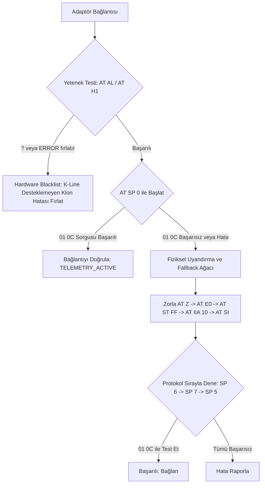

# MotoCortex Global OBD2 Uyumluluk ve Kararlılık Planı v2.0 (Genişletilmiş Revizyon)

Bu plan, **mimar1.md**, **mimar2.md** ve yeni eklenen **mimar3.md** (Donanımsal K-Line & Wake-Up Pulse Sınırlılıkları) raporlarını birleştirerek, sahadaki eski/uyumsuz ECU'lar ve kalitesiz klon adaptörlerden kaynaklanan bağlantı kayıplarını çözmek üzere hazırlanmış kapsamlı ve detaylı bir aksiyon planıdır.

---

## 1. Tespit Edilen Yapısal Problemler ve Analiz

1.  **K-Line Donanımsal Eksiklik (Transceiver Fiziksel Hatası)**: Ucuz Çin malı ELM327 v2.1 klonlarının çoğunda K-Line sinyallerini taşıyacak donanımsal alıcı-verici (transceiver) çipi eksiktir. Adaptöre yazılımsal olarak `AT SP 5` veya `AT SP 3` gönderilse bile elektriksel olarak hatta sinyal basılamaz.
2.  **Yanıtsız Kapasite Sorguları (01 00 Blokesi)**: 2011 Dacia Logan gibi eski araç ECU'ları standart `01 00` (Kapasite Keşfi) komutuna yanıt vermeyi reddedebilir. FSM (Durum Makinesi) bu sorgudan yanıt alamayınca protokolün başarısız olduğunu düşünüp bağlantıyı koparır.
3.  **Yetersiz İlklendirme Akımı (ECU Wake-Up Sorunu)**: Renault/Dacia grubu K-Line araçları, ECU'yu uyandırmak için 5-Baud yavaş ilklendirme (Slow Init) sinyaline ihtiyaç duyar. Standart `AT SP 0` bu elektriksel uyarımı gönderemez.
4.  **Kullanıcının Karanlıkta Kalması**: Adaptör bağlandığı halde ECU'ya ulaşılamadığında ekranda sonsuza kadar dönen bir yüklenme animasyonu kalır. Sorunun telefon/uygulama kaynaklı mı yoksa sahte donanım kaynaklı mı olduğu kullanıcıya dürüstçe açıklanmamaktadır.

---

## 2. Somut Revizyon ve Çözüm Planı

### Faz 1: Donanım Kara Listesi ve Hızlı Teşhis (Hardware Blacklisting)
Kullanıcıyı boşuna bekletmemek adına, adaptöre bağlandığımız ilk saniyede K-Line donanım testi gerçekleştirilecektir.

*   **Aksiyon**: `initializeAndCheckEcu` başlangıcında adaptöre `AT AL` (Uzun mesajlara izin ver) ve `AT H1` (Header göster) komutları gönderilir.
*   **Kabul Kriteri**: Klon veya kırpılmış donanımlar bu komutlara `?` veya `ERROR` yanıtı verir.
*   **Hata Durumu**: Eğer donanım testi başarısız olursa, ECU bağlantı döngüsü anında kırılacak ve state makinesi `HARDWARE_FATAL` durumuna çekilip arayüze neon kırmızı renkle şu hata basılacaktır:
    > **"Kritik Hata: Donanımınız eski araç protokollerini desteklemeyen sahte bir klondur. 2011 Dacia ECU'suna bağlanılamaz. Lütfen kaliteli bir adaptör (v1.5 veya orijinal) edinin."**

---

### Faz 2: Fiziksel Uyandırma (Wake-Up Pulse) Enjeksiyonu
Renault ve Dacia grubunun eski K-Line ECU'larını uyandırmak için elektriksel uyarım (Slow Init) Mutex kuyruğunun en başına enjekte edilecektir.

*   **Aksiyon**: Otomatik protokol arama başarısız olduğunda veya K-Line protokollerine geçildiğinde şu agresif başlatma dizisi kuyruğa sürülür:
    1.  `AT Z` (Tam donanımsal sıfırlama)
    2.  `AT E0` (Yankıyı kapat)
    3.  `AT ST FF` (Zaman aşımını maksimum olan 1 saniyeye çek - K-Line yanıt süresi için şart)
    4.  `AT IIA 10` (ECU adresini Renault/Dacia K-Line için zorla `10` yap)
    5.  `AT SI` (Slow Init - 5 Baud elektriksel uyandırma sinyalini hatta enjekte et)

---

### Faz 3: "Kör İlklendirme" (Blind Polling) ve 01 0C (RPM) Doğrulaması
Bağlantının kurulup kurulmadığını test etmek için yanıtı kesin olan ve her ECU'nun dönmek zorunda olduğu devir sorgusu kullanılacaktır.

*   **Aksiyon**: Protokol doğrulaması yapılırken `01 00` (Kapasite Keşfi) yerine doğrudan **`01 0C` (Motor Devri)** komutu gönderilecektir.
*   **Mantık**: `01 0C` komutuna gelen yanıt `410C` formatındaysa (motor çalışmasa dahi `410C0000` döner), ECU'nun hatta olduğu kesinleşir. Bu durumda kapasite haritası yoksayılarak bağlantı durumu doğrudan `TELEMETRY_ACTIVE` durumuna zorlanacaktır.

---

## 3. Kod Dosyalarında Yapılacak Değişiklikler

### 1. `src/hooks/useBluetooth.ts`
*   `initializeAndCheckEcu` fonksiyonunun başına `AT AL` ve `AT H1` yetenek testi eklenecektir. Başarısızlık durumunda state güncellenerek özel hata mesajı atılacaktır.
*   Protokol doğrulama komutları `"01 00"` yerine `"01 0C"` olarak güncellenecektir.
*   K-Line/ISO fallback kısmına `AT Z -> AT E0 -> AT ST FF -> AT IIA 10 -> AT SI` uyandırma enjeksiyonu entegre edilecektir.

### 2. `App.tsx` (Arayüz Katmanı)
*   ECU bağlantı durumlarında eğer `isCloneDevice` fatal hata durumuna geçtiyse veya donanım K-Line testinden kaldıysa, yüklenme animasyonu kırılarak dürüst neon kırmızı hata mesajı render edilecektir.

---

## 4. Doğrulama ve Test Adımları

1.  **Klon Adaptör Testi**: Sahte v2.1 adaptör takılarak `AT AL` testinin başarısız olması tetiklenmeli ve arayüzde doğru neon kırmızı mesajın belirdiği doğrulanmalıdır.
2.  **Kör İlklendirme Testi**: 2011 Dacia modelinde `01 00` yoksayılarak `01 0C` ile doğrudan `TELEMETRY_ACTIVE` moduna geçildiği test edilmelidir.
3.  **Elektriksel Slow Init Testi**: K-Line araçlarda `AT SI` sinyalinin gönderildiği teşhis günlüklerinden takip edilmelidir.
